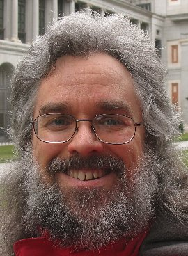
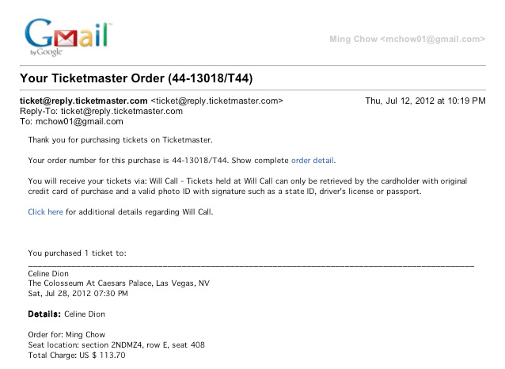

Assignment 5: Forensics
===================================

#####Authors: Nick Teleky and Matt Brennan#####
#####Comp116: Computer Security#####
#####November 20, 2013#####

- - - - - - - - - - - - - - - - - - - - - - - -

###Part 1: Images

Image A: We started by using steghide, and ran the following command on Image A: 

`steghide extract -sf a.jpg`

We were then prompted for a password, and we started by trying a blank password. This worked, and we were able to get
an image of Norman's beautiful, smiling face called prado.jpg (attached in the repo).

Image B: We started by trying a dictionary attack on the password by using a bash script and a wordlist. We didn't find anything in this image.

Image C: After running diff on c.jpg and b.jpg, we found that Image B and C are the same. Both are also different from Image A.

- - - - - - - - - - - - - - - - - - - - - - - - -

###Part 2: SDCard Image

* __What is/are the disk format(s) of the SD card?__

There are two partitions on this disk:
 - Win95 Fat32
 - Linux

* __Is there a phone carrier involved?__

Probably not. After looking at the .bash_history file on the linux partition, the user installs raspi-config, indicating that this
OS is running on a Raspberry Pi. Further, in /usr/bin, there is a list of applications that have been installed; among them are config
apps for an Arduino.  The .bash_history file also indicates that the user installed the Kali Linux distrubution, which is like a hacker's 
tool-kit, and probably couldn't run its full functionality on a phone. While it is possible to install Kali on Android phones, it
seems like this is most likely operating on a raspberry pi and not on a phone.

* __What operating system, including version number, is being used? Please elaborate how you determined this information.__

Kali Linux 1.0

We determined this by looking at the os-release file in /etc/, which contained information about the operating system being
run on the system. This was confirmed by the .bash_history

* __What other applications are installed? Please elaborate how you determined this information.__

To find installed applications, we looked in /usr/bin on the linux partition. We found a lot of apps that, after Google searching them,
 are typically used for security purposes (password cracking, port and network scanning, encryption and decryption, private browsing, etc).
 Here is a small list of some of them:

Arduino
Autopsy
Blind Elephant
BeEF-XSS
BurpSuite
ClusterDB
Exploit6
FindMyHash
iCat-SleuthKit
Msfcli - Metasploit
Paros
SoCat
TraceRoute
WPSScan
SubVersion
UnicornScan
UPower
Wireshark
Ettercap
Cowsay
Tor

* __Is there a root password? If so, what is it?__

Yes; we found the passwd files in /etc/ and ran them through John The Ripper (without needing a wordlist):

root/toor

* __Are there any additional user accounts on the system?__

There appear to be two users:

root  
john  

* __List some of the incriminating evidence that you found. Please elaborate where and how you uncovered the evidence.__

Using Autopsy, we explored the file system of the two partitions. In the Linux partition, we found a folder of pictures. Inside were pictures titled
 old.jpg. After opening them, we found that they were all pictures of a young Celine Dion (determined by downloading several of the images, 
 Google searching for them, and finding that they all pointed to Celine Dion). We also found two setlists for CelineDion, which were in the Documents
 folder. Finally, we found a list of upcoming tour dates for 2013 and 2014, which after checking, were found to be dates that Celine is performing
 at Caesers Palace in Las Vegas, NV.

We also looked in /2/root/ and found the .bash_history file. Upon opening, we found that the suspect previously tried to remove most user files on
 his computer, possibly to avoid detection.

* __Did the suspect move or try to delete any files before his arrest? Please list the name(s) of the file(s) and any indications of their contents that you can find.__

There were a lot of files that at some point had been deleted off the system, including everying in $OrphanFiles$, which appeared to be a video
 compressor or converter, a handful of applications, and a few system files.
Right before the suspect's arrest though, the suspect ran a number of terminal commands to ostensibly remove incriminating files. After looking at 
the .bash_history, we found that the suspect started by deleting several folders out of the root folder:
    
Documents  
Videos  
Pictures  
Music  
Downloads  
Public  
Template  
   
The suspect then tried to recreate the Documents and Pictures folders, according to the bash history.  

The suspect then compressed their Dropbox, then changed Dropbox.zip to .dropbox.zip (to make it a hidden file), then removed the visible dropbox 
file.  

Then, the suspect deleted new1.jpg, new2.jpg, new3.jpg, and receipt.pdf from the system, immediately before being arrested. The 'new' JPEGS are likely 
new pictures of the celebrity (as another folder contained several JPEGS titled old1.jpg, etc.). Receipt.pdf likely contained a receipt from when the 
suspect went to see the celebrity.

* __Are there any encrypted files? If so, list the contents and a brief description of how you obtained the contents.__  

It looks like the .Dropbox.zip file is encrypted. We ran TrueCrypt on this file for several hours and the only thing we were able to get out of it was 
a configuration file. Other than that, the Dropbox.zip was empty.

* __Did the suspect at one point went to see this celebrity? If so, note the date and location where the suspect met the celebrity? Please elaborate how you determined this information.__  

Yes. The suspect, a Mr. Ming Chow, may have gone to see the celebrity at the following date and time:  
Saturday, July 28, 2012 at 7:30 PM  
Colosseum at Caesars Palace, Las Vegas, NV  

We found this by recovering deleted files with foremost. We were able to recover the receipt.pdf, which had a snapshot of a gmail message (seen below):  

* __Is there anything peculiar with the files on the system?__

In /www/, there is an index.html that indicates that the suspect is running a webserver on this device. There are also many applications on the device 
that would aid the suspect in running web servers or applications from the device. The Kali Linux OS is also peculiar, as it is a hacker's toolkit OS, 
and thus contains many open source security applications that could aid the suspect in hacking or attempting to hack into the celebrity's computers, 
email accounts, etc.

* __Who is the celebrity that the suspect has been stalking?__  

Celine Dion