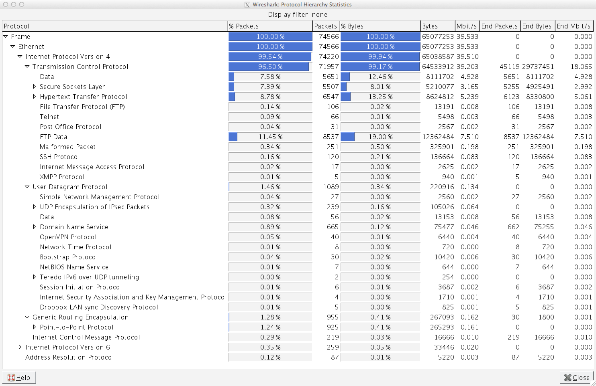

Assignment 1: Packet Sleuth
============================

#### Comp116: Computer Security ####
##### Author: Nicholas Teleky #####
##### Sept 8, 2013 #####

- - - - - - - - - - - - - - - - - - - - - - - - - -

In this assignment, we were given two .pcap files and were asked to analyze them, then answer the questions below. To analyze, I used the following tool(s):

* Wireshark
* Ettercap
* Etterlog
* dsniff

This assignment took me 6 hours to complete.

Analysis below.

- - - - - - - - - - - - - - - - - - - - - - - - - -

### set1.pcap ###

***1. How many packets are there in this set?***

276 packets total.

***2. What protocol was used to transfer files from PC to server?***

File Transfer Protocol (FTP)

***3. Briefly describe why the protocol used to transfer the files is insecure?***

The biggest security flaw with FTP is that all information, including usernames, passwords, and files are sent over the network as
plaintext. This means that anyone could potentially view your logon information and intercept files that are transferred relatively
simply. This could mean that an unauthorized individual could have access to a server of files that they ought not have access to.

***4. What is the secure alternative to the protocol used to transfer files?***

Secure File Transfer Protocol (SFTP) is part of the 'Open-SSH' package, which secures usernames, passwords, and files by encrypting
them over the network.

***5. What is the IP address of the server?***

67.23.79.113

***6. What was the username and password used to access the server?***

Username: stokerj

Password: w00tfu!

***7. How many files were transferred from PC to server?***

Three

***8. What are the names of the files transferred from PC to server?***

code.rtf

secret.pdf

acb.jpg

***9. Extract all the files that were transferred from PC to server.***

*Extracted files contained in this repository*

- - - - - - - - - - - - - - - - - - - - - - - - - -

### set2.pcap ###

***10. How many packets are there in your set?***

74,566 packets.

***11. How many plaintext username-password pairs are there in this packet set?***

I found twelve, four of which were more detailed than USER: public, PASS: [blank].

***12. Briefly describe how you found the username-password pairs.***

Using ettercap and etterlog, I managed to pull data from set2.pcap:

`ettercap -r set2.pcap -Tq -l set2users //creates a .eci file with summary of data.`
`etterlog -p set2users.eci > set2pairs.txt //analyzes user/pass pairs and places into a txt file.`

***13. For each of the plaintext username-password pair that you found, identify the protocol used, server IP, the corresponding domain name (e.g., google.com), and port number.***

 62.173.185.22    TCP 110    USER: brewer       PASS: 1qazxsw209simona12 

 67.128.149.178   TCP 110    USER: mbergeson@hjnews.com         PASS: mb123on

109.168.119.166 (mail.cutaway.it) TCP 143    USER: dmartini@cutaway.it         PASS: se1lasa 

144.122.144.179 (pop3.metu.edu.tr) TCP 110    USER: e129286    PASS: 4.Ekkama

***14. Of all the plaintext username-password pairs that you found, how many of them are legitimate? That is, the username-password was valid, access successfully granted?***

It appears that all were successful that I could find with ettercap.

***15. How did you verified the successful username-password pairs?***

Etterlog placed an '*' next to an account representing a failed logon attempt. If the 
listed pair didn't have a '*' next to it, it was a legitimate logon attempt.

***16. In a few words, explain why I asked you not to log on to websites or services associated with the username-password pairs that you found.***

First, because that's not exactly 'good form' in terms of internet trust and being a 'good guy.'
Second, because there's no easy way of telling what it is we'd be logging into, which could
compromise our own security -- some of these could be tricks designed to get people at a place
like defcon to log in, not knowing that they're giving their own personal information away.
Third, because it's illegal.

Moral: DON'T TRUST PEOPLE AT DEFCON.

***17. What advice would you give to the owners of the username-password pairs that you found so their account information would not be revealed "in-the-clear" in the future?***

1.) Be sure to use https:// when logging onto sites via a browsers.
2.) Don't transfer files over insecure protocols such as FTP.
3.) Don't have electronics on and connected to wifi at Defcon unless you want to lose your identity.

***18. Provide a listing of all IP addresses with corresponding hosts (hostname + domain name) that are in this PCAP set. Describe your methodology.***

*See 'set2hosts.txt'*

I used etterlog to list all IP Addresses and, where applicable, hostnames for those IPs. The 
output can be viewed in the text file.

***19. Provide a summary of the all protocols used. What was the most popular protocol used? Describe your methodology.***

TCP Was the most popular protocol. This was found by going into wireshark and running
statistics on the entire pcap to analyze protocols used. Results are shown in the set2protocols.png.

***20. A fun question: what other interesting things did you find in this PCAP set (e.g., files)?***

Several pdf documents that appear to be things like presentation exports, examples of how to grab passwords from a network (ironic), some images, and other interesting files. All of these could be grabbed using network tools like wireshark and tcp dump.

- - - - - - - - - - - - - - - - - - - - - - - - - -
